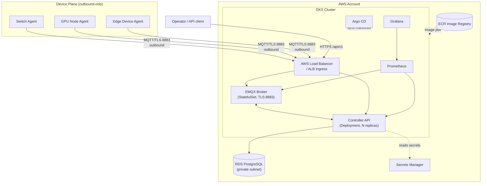
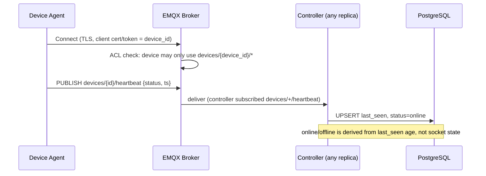
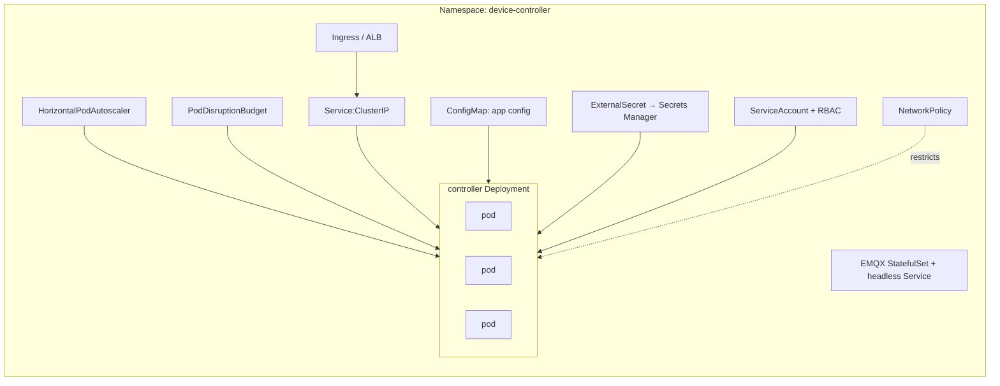
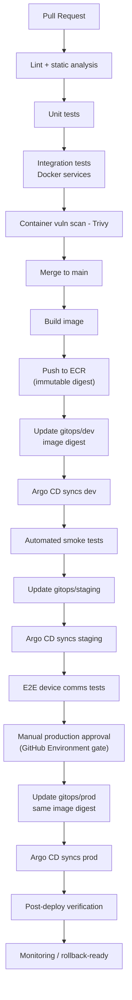
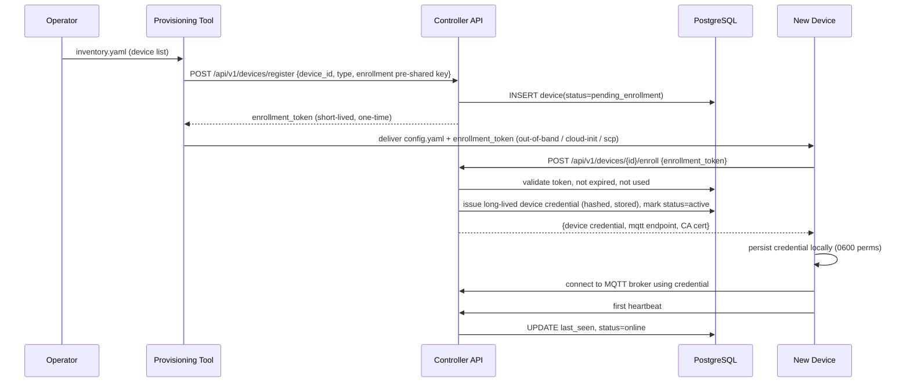
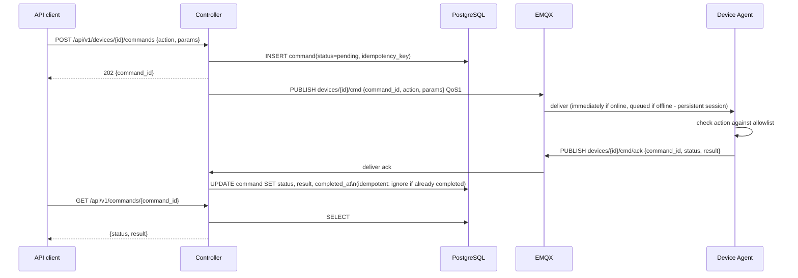

# Cloud Device Controller — Architecture (Phase 1)

## A. Requirements & Assumptions

### Functional requirements
1. Register and provision devices (switches, GPU nodes, generic Linux edge devices) without editing controller code.
2. Secure, authenticated device-to-cloud communication, outbound-only from the device side.
3. Controller → device command dispatch; device → controller acknowledgment + result.
4. Periodic heartbeat + telemetry from each device.
5. Online/offline state tracking per device, derived from heartbeat recency, not socket presence alone (so it survives controller restarts/multiple replicas).
6. Durable device inventory + configuration in a database, not in controller memory.
7. Horizontal scaling of the controller to support 1,000+ concurrently-connected devices.
8. Rolling controller updates with zero device-visible disruption (devices reconnect transparently).
9. Bulk/automated onboarding of new devices (inventory file → provisioning tool), no manual per-device controller changes.

### Non-functional requirements
- **Scale target:** 1,000 concurrent devices, heartbeat interval 30s → ~33 heartbeats/sec sustained, bursty on reconnect storms.
- **Availability:** controller is horizontally scaled (≥2 replicas), stateless app tier, PostgreSQL (RDS) as the durable store, survives a single pod/node loss.
- **Security:** mutual TLS or token-based per-device identity; no shared "god" credential; least-privilege IAM; secrets never in Git or images.
- **Delivery semantics:** at-least-once for commands and heartbeats, with idempotency keys so duplicate delivery doesn't double-apply effects (see §11 in the full spec — implemented in Phase 2/11).
- **Operability:** every component has health/readiness probes, structured logs, and Prometheus metrics.

### Explicit assumptions (stated per your instruction #8 in engineering requirements)
- Devices are **outbound-only** initiators — we never dial into a device. This is required for devices sitting behind NAT/firewalls (typical for switches/GPU nodes in a datacenter or branch), and it is the single biggest driver of the messaging architecture choice below.
- "GPU telemetry" will be **simulated by default** (random/synthetic values); real NVML (`nvidia-smi`/`pynvml`) integration is included as an optional code path but not required to run the demo, since most development/test environments lack GPUs.
- Local development does not require AWS. AWS is only needed starting Phase 6.
- One engineer is building and operating this system — the architecture is deliberately a **single controller service + one broker + one database**, not a microservices sprawl.

---

## B. Technology Decisions

| Decision | Chosen | Alternatives considered | Why |
|---|---|---|---|
| Cloud provider | **AWS** | Azure, GCP | Per your instruction; EKS/RDS/ECR/Secrets Manager/ALB form a coherent, widely-documented stack. |
| Controller language/framework | **Go (net/http, pgx, paho.mqtt.golang)** | Python + FastAPI | Go gives a single static binary, low memory per connection, cheap concurrency for many simultaneous MQTT/DB operations, and a small distroless image. The standard-library router is sufficient for this API surface. |
| Device agent language | **Go** | Python | A dependency-free static binary that is easy to ship to constrained devices and run under systemd with no interpreter or virtualenv; shares one language with the controller. |
| Device↔cloud messaging | **MQTT (via Kubernetes-hosted EMQX broker)** | gRPC streaming, WebSockets, plain HTTPS polling | See detailed evaluation below. |
| Database | **PostgreSQL (Amazon RDS in prod, local Postgres container in dev)** | DynamoDB, MongoDB | Relational model fits device inventory/commands well (foreign keys, transactional command-state updates); RDS is fully managed, so no self-run DB operations. |
| Secrets | **AWS Secrets Manager** + K8s External Secrets in prod; `.env`/Docker secrets in dev | Vault | Secrets Manager is managed, IAM-integrated, no extra cluster to run; avoids a self-hosted Vault for a one-engineer project. |
| Container registry | **Amazon ECR** | Docker Hub | Private, IAM-integrated, integrates directly with EKS node IAM roles for pulls. |
| Kubernetes packaging | **Helm** | Kustomize | Helm's templating + per-environment `values-*.yaml` fits the dev/staging/prod promotion model you specified. |
| IaC | **Terraform** | AWS CDK, Pulumi | Explicitly requested; mainstream, widely documented, plan/apply workflow is easy to reason about. |
| CI | **GitHub Actions** | CircleCI, Jenkins | Requested; native GitHub OIDC→AWS federation removes the need for long-lived AWS keys in CI. |
| CD | **Argo CD (GitOps)** | GitHub Actions `kubectl apply` | Requested; decouples "build/push an image" from "deploy," gives drift detection and declarative rollback via Git revert. |
| Monitoring | **Prometheus + Grafana** | Datadog, CloudWatch only | Requested; open-source, runs identically in local kind and in EKS, no per-host licensing cost. |

### Messaging architecture evaluation (device ↔ cloud)

| Option | Reliability | Ops complexity | Security | Scale to 1,000+ | NAT/firewall fit |
|---|---|---|---|---|---|
| **MQTT (EMQX)** | High — QoS 1 gives at-least-once, persistent sessions queue commands for offline devices | Medium — one more stateful service to run, but EMQX clusters natively and has a mature Helm chart | Strong — per-device TLS client cert or token, broker-enforced ACLs (device X may only publish/subscribe its own topics) | Excellent — MQTT brokers are built for 10k–1M persistent, mostly-idle connections; EMQX benchmarks well past our target | Excellent — single outbound TCP/TLS connection (port 8883), survives NAT, firewall only needs one egress rule |
| gRPC bidi streaming | High | Medium-high — need to handle load-balancing long-lived streams behind K8s Services/ALB (tricky; ALB doesn't LB gRPC streams well without extra config) | Strong (mTLS native) | Good, but each pod holds raw streams in memory → sticky-session / rebalancing problems on rolling deploys | Good if device can dial out, but intermediate L7 proxies sometimes break long-lived HTTP/2 streams |
| WebSockets | Medium | Medium | Strong (TLS) | Good but same in-memory-stream problem as gRPC — a WS lives on exactly one pod, complicating multi-replica command routing | Good |
| Plain HTTPS polling | Low-medium (poll latency vs. command latency tradeoff) | Low | Strong | Good — stateless, trivially horizontally scalable | Excellent |

**Decision: MQTT via a Kubernetes-hosted EMQX broker**, because:
1. It is purpose-built for exactly our shape of problem — many persistent, mostly-idle, NAT-bound clients.
2. QoS 1 + persistent sessions give at-least-once delivery and offline command queuing "for free" at the broker layer, rather than us re-implementing it in application code (which gRPC/WS/HTTPS would all require).
3. Broker-side ACLs give per-device topic isolation (`devices/{device_id}/...`) as a first security layer, independent of controller code.
4. It decouples controller replicas from any single device's connection — any controller pod can publish a command to `devices/{id}/cmd`; the broker handles delivery to whichever session is active. This directly solves the "duplicate command execution / conflicting device ownership" requirement in §6.

**Why not AWS IoT Core (managed MQTT)?** It's a legitimate, arguably simpler choice for a real production system (no broker to operate) and is called out in `docs/deployment.md` as the recommended swap-in for production hardening. We run EMQX inside EKS instead so the reference implementation stays cloud-agnostic, running identically in local `kind`/Compose and in EKS, which matters for your "test everything locally first" requirement. This is a deliberate, stated trade-off: self-hosting one more stateful service (ops cost) in exchange for portability and zero vendor lock-in (educational value).

Topic design:
```
devices/{device_id}/heartbeat      device → broker  (QoS 1)
devices/{device_id}/telemetry      device → broker  (QoS 1)
devices/{device_id}/cmd            broker → device  (QoS 1, retained=false, persistent session queues if offline)
devices/{device_id}/cmd/ack        device → broker  (QoS 1)
```
Enrollment (first-contact credential issuance) happens over the REST API, not MQTT — a device cannot get an MQTT credential without first proving it holds a valid enrollment token via `POST /api/v1/devices/{id}/enroll`. Only after that does it connect to the broker. The controller is itself one (clustered) MQTT client, subscribed to `devices/+/heartbeat`, `devices/+/telemetry`, `devices/+/cmd/ack`.

---

## C. Architecture Diagrams

### C.1 High-level cloud architecture


### C.2 Device-to-cloud communication


### C.3 Kubernetes architecture


### C.4 CI/CD pipeline


### C.5 Device provisioning & onboarding sequence


### C.6 Command and acknowledgment sequence


### C.7 Control-plane vs device-plane responsibilities
- **Control plane** (cloud): identity issuance, inventory, command orchestration, durable state, auth/authz, observability. Runs in EKS, horizontally scaled, stateless app tier.
- **Device plane** (edge): agent process on each device. Holds only its own identity/credential + local config cache. Never trusts another device's identity. Never executes arbitrary commands — allowlist only.

### C.8 Network, DNS, TLS, firewall requirements
- Single DNS name (e.g. `controller.example.com`) → ALB → two backend paths: `/api/*` (controller HTTPS) and MQTT over TLS on 8883 (separate NLB or ALB TCP listener, since MQTT isn't HTTP).
- TLS everywhere: ACM-issued cert for the ALB; EMQX terminates its own TLS listener using a cert from Secrets Manager/ACM-exported material.
- Devices need exactly one outbound firewall rule: TCP 8883 (MQTT/TLS) and TCP 443 (HTTPS, for enrollment REST call) to the controller's DNS name. No inbound rule needed on any device network.
- RDS lives in private subnets only, security-group-restricted to the EKS node security group — never public.

### C.9 Failure behavior
| Component fails | Effect | Recovery |
|---|---|---|
| One controller pod | Other replicas keep serving; K8s reschedules pod | Automatic, seconds |
| EKS node | Pods reschedule to healthy nodes (PDB prevents all controller pods draining at once) | Automatic, ~1 min |
| EMQX broker pod | Devices reconnect (agent has retry/backoff); persistent sessions on a StatefulSet+PVC survive pod restart | Automatic reconnect, queued commands preserved |
| RDS | Controller `/readyz` fails → ALB stops routing new traffic; in-flight commands queue at MQTT layer until DB returns | Managed by RDS Multi-AZ failover in prod |
| Device network blip | Agent retries with exponential backoff + jitter; broker marks session offline; heartbeat gap flips device to "offline" after grace period | Automatic on reconnect |
| Duplicate command delivery | Idempotency key + DB unique constraint — second apply is a no-op | By design |
